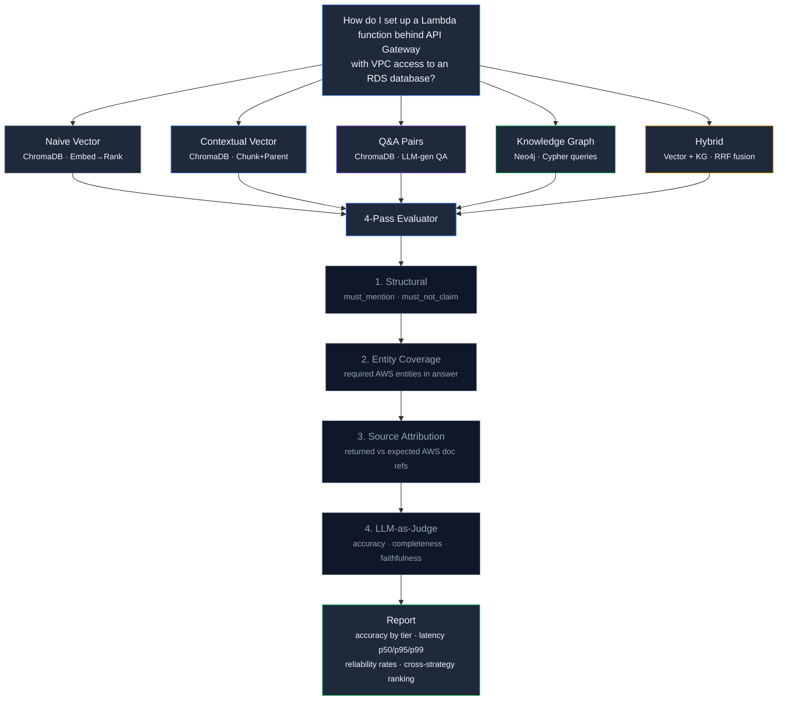

# KB Arena

Benchmark knowledge graphs vs vector RAG on AWS documentation.

KB Arena runs the same 200 questions against 5 retrieval strategies — naive vector, contextual vector, Q&A pairs, knowledge graph, and hybrid — and measures accuracy, latency percentiles, and response reliability across 3 AWS documentation corpora (Compute, Storage, Networking). The result: empirical evidence for which data representation actually works when your documentation spans 200+ interconnected AWS services.

   



---

## Screenshots

**Benchmark results** — Sortable accuracy table by tier with grouped bar chart. Hybrid and knowledge graph strategies dominate on tier 3-5 questions where cross-service AWS queries break vector RAG.


**Strategy comparison** — Ask the same question about AWS services to all 5 strategies simultaneously. Toggle strategies on/off, switch AWS corpora, and compare answers side-by-side with SSE streaming.


**Knowledge graph explorer** — Interactive force-directed graph visualization of AWS service dependencies extracted from documentation. Glow effects, degree-based sizing, hover highlighting, bezier edges, and zoom controls.


**Home page** — Overview of the 5 strategies, 3 AWS corpora, 5 difficulty tiers, and the evaluation methodology.


---

## Why AWS Documentation?

AWS has 200+ services with deep cross-service dependencies. A question like "How do I set up Lambda behind API Gateway with VPC access to RDS?" requires understanding 6 interconnected resources: API Gateway, Lambda, IAM Execution Role, VPC Subnets, Security Groups, and RDS Subnet Groups. This is exactly where knowledge graphs outperform vector RAG — the relationships between services matter more than the text of any single documentation page.

KB Arena uses live AWS documentation as the test corpus because:

- **Real complexity** — AWS service relationships are inherently graph-structured (IAM policies, VPC networking, service integrations)
- **Known ground truth** — AWS docs are authoritative and verifiable
- **Practical relevance** — "How do I configure X with Y?" is the #1 question format for AWS users
- **Multi-hop reasoning** — Tier 4-5 questions require traversing 3-5 service dependencies that no single doc page covers

---

## The Question This Answers

> "What should the data format be for freeform texts or multiple documents so we can have an accurate, reliable, and fast knowledge retrieval + chatbot system?"

The source format matters far less than the retrieval architecture. Knowledge graphs as an intermediate representation — extracted from AWS documentation — beat every other approach on multi-hop, relational, and comparative queries. Pure vector RAG wins on simple lookups but collapses on queries touching 3+ interconnected AWS services.

This project proves it with real AWS data, reproducible benchmarks, and a live side-by-side chatbot demo.

---

## How It Compares

| Capability | KB Arena | RAGAS | BEIR | LlamaIndex Bench |
|---|:---:|:---:|:---:|:---:|
| Knowledge graph strategy | Y | - | - | - |
| Hybrid (vector + KG) strategy | Y | - | - | - |
| Side-by-side chatbot demo | Y | - | - | - |
| Per-tier difficulty breakdown | 5 tiers | - | - | - |
| Latency percentiles (p50/p95/p99) | Y | - | - | - |
| Response reliability tracking | Y | Y | - | - |
| 4-pass evaluator (structural + LLM) | Y | LLM-only | BM25 | LLM |
| Multi-corpus (3 AWS domains) | Y | Custom | 18 datasets | Custom |
| Pip-installable CLI | Y | Y | Y | - |
| Entity coverage scoring | Y | - | - | - |
| Source attribution scoring | Y | Y | - | - |

RAGAS and BEIR benchmark retrieval quality but only test vector-based approaches. KB Arena adds knowledge graph and hybrid strategies to the comparison, with a difficulty-tiered question set that isolates exactly where each approach breaks down on AWS documentation.

---

## Quick Start

```bash
pip install kb-arena
```

Set API keys:

```bash
export ANTHROPIC_API_KEY=sk-ant-...
export OPENAI_API_KEY=sk-...   # for text-embedding-3-large
```

Start Neo4j (for knowledge graph strategy):

```bash
docker compose up neo4j -d
```

Run the full pipeline on AWS documentation:

```bash
# 1. Download and parse AWS documentation into unified Document model
kb-arena ingest ./aws-docs --corpus aws-compute

# 2. Build knowledge graph of AWS service dependencies in Neo4j
kb-arena build-graph --corpus aws-compute

# 3. Build vector indexes in ChromaDB
kb-arena build-vectors --corpus aws-compute

# 4. Run benchmark (200 questions × 5 strategies)
kb-arena benchmark --corpus all --strategy all

# 5. Generate report
kb-arena report

# 6. Launch side-by-side chatbot demo
kb-arena serve
```

The API runs at `http://localhost:8000` and the Next.js frontend at `http://localhost:3000`.

---

## Real-World Examples

### 1. Ingest AWS Documentation

Parse AWS documentation into the unified Document model:

```bash
$ kb-arena ingest ./aws-docs --corpus aws-compute --format html

Parsing ./aws-docs (format: html)
  lambda/latest/dg/configuration-vpc.html → 34 sections, 9,847 tokens
  ec2/latest/userguide/instance-types.html → 89 sections, 28,103 tokens
  ecs/latest/developerguide/task-definitions.html → 47 sections, 14,291 tokens
  ...
Written 412 documents to datasets/aws-compute/processed/docs.jsonl
```

Three AWS corpora ship out of the box:

```bash
kb-arena ingest ./aws-docs --corpus aws-compute   # Lambda, EC2, ECS, EKS, Batch
kb-arena ingest ./aws-docs --corpus aws-storage    # S3, DynamoDB, RDS, EFS, ElastiCache
kb-arena ingest ./aws-docs --corpus aws-networking # VPC, CloudFront, Route 53, API Gateway, ELB
```

### 2. Build the Knowledge Graph

Extract AWS service entities and relationships into Neo4j:

```bash
$ kb-arena build-graph --corpus aws-compute

Extracting entities from 412 documents...
  Lambda → Service (connects_to: VPC, RDS, S3, DynamoDB, SQS)
  API Gateway → Service (invokes: Lambda, integrates: Cognito)
  IAM Execution Role → Policy (assumed_by: Lambda, ECS)
  Security Group → Resource (protects: RDS, Lambda, EC2)
  ...
Resolving duplicates (Jaro-Winkler threshold: 0.92)...
  Merged 23 duplicate entities
Writing to Neo4j: 1,847 nodes, 4,212 relationships
Done.
```

### 3. Build Vector Indexes

Build ChromaDB indexes for the three vector-backed strategies:

```bash
$ kb-arena build-vectors --corpus aws-compute --strategy all

Building index: naive_vector (412 documents)
  Embedding with text-embedding-3-large (3072 dims)...
  412 chunks indexed in ChromaDB
Done: naive_vector

Building index: contextual_vector (412 documents)
  Adding parent AWS service context to each chunk...
  412 chunks indexed in ChromaDB
Done: contextual_vector

Building index: qna_pairs (412 documents)
  Generating Q&A pairs via Claude Sonnet...
  1,847 Q&A pairs indexed in ChromaDB
Done: qna_pairs
```

### 4. Run the Benchmark

Run 200 questions about AWS services against all 5 strategies:

```bash
$ kb-arena benchmark --corpus all --strategy all

Running benchmark: aws-compute × naive_vector (75 questions)
  ████████████████████████████████████████ 75/75 [00:42]
Running benchmark: aws-compute × knowledge_graph (75 questions)
  ████████████████████████████████████████ 75/75 [01:14]
  ...

Results written to:
  results/aws-compute_naive_vector.json
  results/aws-compute_contextual_vector.json
  results/aws-compute_qna_pairs.json
  results/aws-compute_knowledge_graph.json
  results/aws-compute_hybrid.json
  results/aws-storage_naive_vector.json
  ...
```

Filter by corpus, strategy, or tier:

```bash
kb-arena benchmark --corpus aws-compute --strategy knowledge_graph --tier 4
```

### 5. Generate the Report

```bash
$ kb-arena report

Report written to results/report.md
Summary written to results/summary.json
```

The report contains 6 sections per corpus plus a cross-strategy ranking:

```
# KB Arena Benchmark Report

## aws-compute

### Overall Accuracy by Strategy
| Strategy          | Accuracy | Completeness | Faithfulness | Avg Latency (ms) | Total Cost  | Cost/Correct |
|-------------------|----------|--------------|--------------|------------------|-------------|--------------|
| naive_vector      | ...      | ...          | ...          | ...              | $...        | $...         |
| contextual_vector | ...      | ...          | ...          | ...              | $...        | $...         |
| qna_pairs         | ...      | ...          | ...          | ...              | $...        | $...         |
| knowledge_graph   | ...      | ...          | ...          | ...              | $...        | $...         |
| hybrid            | ...      | ...          | ...          | ...              | $...        | $...         |

### Accuracy by Tier
| Strategy          | Tier 1 - Factoid | Tier 2 - Procedural | Tier 3 - Comparative | Tier 4 - Relational | Tier 5 - Multi-hop |

## Cross-Strategy Ranking
| Rank | Strategy         | Avg Accuracy | p50 Latency (ms) | Success Rate | Composite |

*Composite = 0.5 * Accuracy + 0.3 * Reliability + 0.2 * Latency Score*
```

### 6. Side-by-Side Chatbot Demo

```bash
$ kb-arena serve --port 8000

INFO:     KB Arena API v0.1.0
INFO:     Neo4j connected at bolt://localhost:7687
INFO:     5 strategies loaded: naive_vector, contextual_vector, qna_pairs, knowledge_graph, hybrid
INFO:     Uvicorn running on http://0.0.0.0:8000
```

The chatbot API supports both synchronous and SSE streaming:

```bash
# Synchronous — single strategy
$ curl -s -X POST http://localhost:8000/chat \
  -H 'Content-Type: application/json' \
  -d '{"query": "What IAM permissions does Lambda need for VPC access?", "strategy": "knowledge_graph"}' | python3 -m json.tool

{
  "answer": "Lambda requires the AWSLambdaVPCAccessExecutionRole managed policy, which grants ec2:CreateNetworkInterface, ec2:DescribeNetworkInterfaces, and ec2:DeleteNetworkInterface permissions for creating ENIs in VPC subnets.",
  "strategy_used": "knowledge_graph",
  "sources": ["lambda/latest/dg/configuration-vpc.html", "lambda/latest/dg/lambda-intro-execution-role.html"],
  "graph_context": {
    "entities": [
      {"name": "Lambda", "type": "Service"},
      {"name": "IAM Execution Role", "type": "Policy"},
      {"name": "VPC", "type": "Service"}
    ],
    "relationships": [
      {"source": "Lambda", "type": "ASSUMES", "target": "IAM Execution Role"},
      {"source": "Lambda", "type": "DEPLOYED_IN", "target": "VPC"}
    ]
  },
  "latency_ms": 823.4,
  "tokens_used": 147,
  "cost_usd": 0.0012
}
```

SSE streaming returns 4 event types:

```
event: token
data: {"text": "Lambda requires"}

event: token
data: {"text": " the AWSLambdaVPCAccessExecutionRole"}

event: done
data: {"sources": ["lambda/latest/dg/configuration-vpc.html"], "strategy_used": "knowledge_graph"}

event: meta
data: {"latency_ms": 823.4, "tokens_used": 147, "cost_usd": 0.0012}
```

---

## The 200 Questions

Questions are organized into 5 difficulty tiers across 3 AWS documentation corpora:

| Tier | Type | Hops | Where vector RAG breaks | Example |
|------|------|------|--------------------------|---------|
| 1 | Factoid | 1 | All strategies competitive | "What is the default timeout for a Lambda function?" |
| 2 | Procedural | 2 | Vector drops to ~60% | "How do I enable server-side encryption on an S3 bucket with KMS?" |
| 3 | Comparative | 2-3 | Vector drops to ~30%, graph dominates | "Compare S3 Standard vs Glacier vs Glacier Deep Archive for compliance archival" |
| 4 | Relational | 3-4 | Only graph answers correctly | "What IAM policies does an ECS task need to pull from ECR, write to CloudWatch, and read from Secrets Manager?" |
| 5 | Multi-hop | 3-5 | Only graph + provenance answers | "How does a request flow from Route 53 through CloudFront with WAF to an ALB target group running ECS Fargate tasks?" |

### Corpora

| Corpus | Questions | Domain | AWS Services |
|--------|-----------|--------|--------------|
| aws-compute | 75 | Compute services | Lambda, EC2, ECS, EKS, Batch, Fargate |
| aws-storage | 65 | Storage & databases | S3, DynamoDB, RDS, EFS, ElastiCache, Redshift |
| aws-networking | 60 | Networking & delivery | VPC, CloudFront, Route 53, API Gateway, ELB, WAF |

Each question includes ground truth, required entities, source refs from AWS documentation, `must_mention` terms, and `must_not_claim` terms — all hand-verified against current AWS docs.

### Question Format

Questions are defined in YAML with full evaluation metadata:

```yaml
- id: "aws-compute-t4-003"
  tier: 4
  type: relational
  hops: 3
  question: "How do I set up a Lambda function behind API Gateway with VPC access to an RDS database?"
  ground_truth:
    answer: "Create API Gateway with Lambda proxy integration. Configure Lambda with VPC subnets and security groups..."
    source_refs:
      - "lambda/latest/dg/configuration-vpc.html"
      - "AmazonRDS/latest/UserGuide/USER_VPC.html"
      - "apigateway/latest/developerguide/set-up-lambda-proxy-integrations.html"
    required_entities:
      - "API Gateway"
      - "Lambda"
      - "IAM Execution Role"
      - "VPC"
      - "Security Group"
      - "RDS"
  constraints:
    must_mention:
      - "AWSLambdaVPCAccessExecutionRole"
      - "security group"
      - "private subnet"
    must_not_claim:
      - "Lambda can access RDS without VPC configuration"
      - "API Gateway needs VPC access to invoke Lambda"
```

---

## The 5 Strategies

### Strategy 1: Naive Vector

The baseline every RAG tutorial teaches. Chunk AWS doc pages, embed with `text-embedding-3-large` (3072 dimensions), store in ChromaDB, retrieve top-k by cosine similarity, generate answer.

**Strengths:** Fast, simple, good on single-service factoid lookups.
**Weakness:** No understanding of cross-service dependencies. "What IAM policies does an ECS task need for ECR and CloudWatch?" returns chunks about ECS but can't connect the IAM→ECR→CloudWatch dependency chain.

### Strategy 2: Contextual Vector

Same as naive vector, but each chunk is embedded with its parent AWS service context prepended. A chunk from the Lambda VPC docs gets embedded as "AWS Lambda developer guide — VPC configuration: When you connect a function to a VPC..."

**Strengths:** Better at disambiguating service-specific terms — "security group" in VPC context vs EC2 context vs RDS context.
**Weakness:** Still can't traverse cross-service relationships.

### Strategy 3: Q&A Pairs

LLM pre-generates question-answer pairs from each AWS doc page at index time. At query time, the question is matched against pre-generated questions via vector similarity.

**Strengths:** Direct question-to-answer mapping — no retrieval noise.
**Weakness:** Only answers questions the LLM thought to generate. Novel cross-service architecture questions fall through.

### Strategy 4: Knowledge Graph

Extracts AWS services, resources, policies, and their dependencies into Neo4j using AWS-specific schemas. Queries are classified by intent and routed to specialized Cypher templates. Entity resolution uses Jaro-Winkler similarity for fuzzy matching of AWS service names.

Four Cypher templates:

```cypher
-- Multi-hop traversal (tier 4-5 questions)
MATCH path = (start:Service)-[*1..{depth}]-(connected)
WHERE start.name = $target
RETURN connected.name, type(connected), length(path) AS hops

-- Cross-service dependency chain
MATCH path = (source:Service)-[:INVOKES|CONNECTS_TO|DEPLOYED_IN*1..4]->(dep)
WHERE source.name = $start
RETURN dep.name, length(path) AS depth

-- Service comparison
MATCH (a:Service)-[r1]-(shared)-[r2]-(b:Service)
WHERE a.name = $service_a AND b.name = $service_b
RETURN shared.name, type(r1), type(r2)
```

**Strengths:** Multi-hop reasoning across AWS services, dependency chain queries, service comparisons.
**Weakness:** Slower (Neo4j round-trips), requires schema design per AWS domain.

### Strategy 5: Hybrid

Three-stage intent classification determines routing:

```
factoid / exploratory → contextual_vector (fast path)
comparison / relational → knowledge_graph (graph path)
procedural → both paths, fused via RRF, re-ranked by Sonnet
```

**Strengths:** Best of both — vector for recall on single-service questions, graph for precision on cross-service architecture queries.
**Weakness:** Highest latency (two retrieval paths + re-ranking), most complex.

---

## Architecture

```
kb_arena/
├── cli.py                        # Typer CLI — 7 commands
├── settings.py                   # Pydantic-settings, all config from env
├── ingest/                       # Stage 1: AWS documentation parsing
│   ├── pipeline.py               # Orchestrator — detect format, dispatch parser
│   └── parsers/
│       ├── html.py               # AWS HTML documentation parser
│       ├── markdown.py           # Markdown section parser
│       └── aws_docs.py           # AWS-specific doc structure parser
├── graph/                        # Stage 2: knowledge graph
│   ├── schema.py                 # AWS service node/rel enums
│   ├── extractor.py              # LLM entity/relationship extraction
│   ├── resolver.py               # Jaro-Winkler entity resolution
│   ├── neo4j_store.py            # Async Neo4j driver wrapper
│   ├── cypher_templates.py       # Intent → Cypher template mapping
│   ├── cypher_generator.py       # Dynamic Cypher generation
│   └── analyzer.py               # Graph statistics and validation
├── strategies/                   # Stage 3: the 5 retrieval approaches
│   ├── base.py                   # Abstract Strategy + AnswerResult model
│   ├── naive_vector.py           # Strategy 1: embed → rank
│   ├── contextual_vector.py      # Strategy 2: parent-context embedding
│   ├── qna_pairs.py              # Strategy 3: pre-generated Q&A
│   ├── knowledge_graph.py        # Strategy 4: Neo4j + Cypher
│   └── hybrid.py                 # Strategy 5: vector + KG + RRF fusion
├── benchmark/                    # Stage 4: evaluation
│   ├── questions.py              # YAML question loader
│   ├── evaluator.py              # 4-pass evaluator
│   ├── runner.py                 # Orchestrator with timeout/retry
│   └── reporter.py               # Markdown + JSON report generator
├── chatbot/                      # Stage 5: demo
│   ├── api.py                    # FastAPI with SSE streaming + rate limiting
│   ├── router.py                 # 3-stage intent classifier
│   └── session.py                # Conversation session management
├── llm/
│   └── client.py                 # Dual-model: Haiku classify, Sonnet generate
├── models/                       # Pydantic v2 (central interchange format)
│   ├── document.py               # Document, Section, Chunk
│   ├── graph.py                  # Entity, Relationship, GraphContext
│   ├── benchmark.py              # Question, Score, AnswerRecord, BenchmarkResult
│   └── api.py                    # ChatRequest, ChatResponse
└── viz/                          # Visualization utilities

web/                              # Next.js 14 frontend
├── app/                          # App router pages
├── components/
│   ├── ChatPanel.tsx             # Side-by-side strategy chat with SSE
│   ├── BenchmarkTable.tsx        # Sortable results table
│   ├── TierChart.tsx             # Recharts accuracy by tier
│   ├── GraphViewer.tsx           # Canvas force-directed graph viz (Gephi-style)
│   └── Nav.tsx                   # Navigation
└── lib/
    └── api.ts                    # Typed API client

datasets/
├── aws-compute/questions/        # 75 questions (5 tiers × 8-20 each)
├── aws-storage/questions/        # 65 questions (5 tiers × 8-15 each)
└── aws-networking/questions/     # 60 questions (5 tiers × 12 each)
```

---

## Graph Schema — AWS Services

The knowledge graph schema models AWS service architecture:

```
Service ─INVOKES─→ Service          (API Gateway → Lambda)
Service ─CONNECTS_TO─→ Service      (Lambda → RDS)
Service ─DEPLOYED_IN─→ Service      (Lambda → VPC)
Service ─TRIGGERED_BY─→ Service     (Lambda → SQS)
Service ─READS_FROM─→ Service       (Lambda → S3)
Service ─LOGS_TO─→ Service          (ECS → CloudWatch)
Resource ─PROTECTS─→ Service        (Security Group → RDS)
Resource ─HOSTS─→ Service           (Subnet → RDS)
Policy ─MANAGED_BY─→ Service        (Execution Role → IAM)
Service ─ASSUMES─→ Policy           (Lambda → Execution Role)
```

Node types: Service, Resource, Policy, Feature
Relationship types: INVOKES, CONNECTS_TO, DEPLOYED_IN, TRIGGERED_BY, READS_FROM, LOGS_TO, PROTECTS, HOSTS, CONTAINS, ASSUMES, MANAGED_BY, ROUTES_TO, FORWARDS_TO, PUBLISHES_TO, USES, PROTECTED_BY, PULLS_FROM

---

## CLI Reference

| Command | Description |
|---|---|
| `ingest <path>` | Parse AWS docs into JSONL. Options: `--corpus`, `--format` (auto/html/markdown) |
| `build-graph` | Extract AWS entities/rels → Neo4j. Options: `--corpus`, `--schema` (auto/aws-compute/aws-storage/aws-networking) |
| `build-vectors` | Build ChromaDB indexes. Options: `--corpus`, `--strategy` (all/naive/contextual/qna) |
| `benchmark` | Run evaluation. Options: `--corpus`, `--strategy`, `--tier` (0=all) |
| `report` | Generate report. Options: `--corpus`, `--output` |
| `serve` | Launch chatbot API. Options: `--host`, `--port`, `--reload` |
| `download <corpus>` | Download raw AWS documentation files |

All commands are independently re-runnable. Each stage writes to disk (JSONL, Neo4j, ChromaDB, JSON results) so you can re-run any stage without repeating earlier ones.

---

## Environment Variables

All prefixed with `KB_ARENA_`. Loaded from `.env` file or environment.

### Required

| Variable | Description |
|----------|-------------|
| `ANTHROPIC_API_KEY` | Anthropic API key (Sonnet for generation/evaluation, Haiku for classification) |
| `OPENAI_API_KEY` | OpenAI API key (text-embedding-3-large, 3072 dimensions) |

### Neo4j

| Variable | Default | Description |
|----------|---------|-------------|
| `NEO4J_URI` | `bolt://localhost:7687` | Neo4j Bolt connection URI |
| `NEO4J_USER` | `neo4j` | Neo4j username |
| `NEO4J_PASSWORD` | `kbarena` | Neo4j password |

### LLM Models

| Variable | Default | Description |
|----------|---------|-------------|
| `GENERATE_MODEL` | `claude-sonnet-4-6` | Model for generation, extraction, evaluation |
| `FAST_MODEL` | `claude-haiku-4-5-20251001` | Model for classification (~20 tokens, <50ms) |

### Benchmark

| Variable | Default | Description |
|----------|---------|-------------|
| `BENCHMARK_TEMPERATURE` | `0.0` | LLM temperature for benchmark runs |
| `BENCHMARK_MAX_CONCURRENT` | `5` | Max parallel queries |
| `BENCHMARK_QUERY_TIMEOUT_S` | `120` | Per-query timeout in seconds |

---

## Deployment

### Docker Compose (all services)

```bash
echo "ANTHROPIC_API_KEY=sk-ant-..." > .env
echo "OPENAI_API_KEY=sk-..." >> .env

docker compose up -d
```

| Service | Image | Purpose | Port |
|---------|-------|---------|------|
| `neo4j` | `neo4j:5-community` | Knowledge graph (APOC plugin) | 7474, 7687 |
| `api` | Built from Dockerfile | FastAPI backend | 8000 |
| `web` | Built from `./web` | Next.js 14 frontend | 3000 |

---

## Testing

```bash
pip install -e '.[dev]'

# Run all unit tests (339 tests)
pytest tests/ -q

# Run specific test modules
pytest tests/test_benchmark.py -v     # evaluator, models, aggregation
pytest tests/test_strategies.py -v    # all 5 strategies
pytest tests/test_graph/ -v           # cypher, extractor, resolver
pytest tests/test_ingest.py -v        # parsers

# Integration tests (requires Neo4j + ChromaDB running)
pytest tests/integration/ -v

# Lint + format
ruff check . && ruff format --check .
```

---

## Tech Stack

| Component | Technology | Purpose |
|-----------|-----------|---------|
| LLM (generation) | Claude Sonnet 4.6 | Answer generation, evaluation, entity extraction |
| LLM (classification) | Claude Haiku 4.5 | Intent classification (~20 tokens, <50ms) |
| Embeddings | text-embedding-3-large | 3072-dim vectors for ChromaDB |
| Vector store | ChromaDB 0.5 | Strategies 1-3 (persistent, local) |
| Graph store | Neo4j 5 (Community) | Strategy 4 (APOC plugin for graph algorithms) |
| Backend | FastAPI 0.115 + Uvicorn | Chatbot API with SSE streaming |
| Frontend | Next.js 14 + Tailwind | Side-by-side demo, benchmark tables, graph viz |
| Graph viz | Canvas (custom) | Force-directed graph with glow, bezier edges, hover highlighting |
| Charts | Recharts | Accuracy by tier charts |
| Models | Pydantic v2 | All data interchange — 15 models across 4 modules |
| CLI | Typer 0.12 + Rich | 7 pipeline commands |
| Entity resolution | Jellyfish | Jaro-Winkler fuzzy matching |
| Testing | pytest + pytest-asyncio | 339 tests across 18 files |
| Lint/Format | Ruff | Check + format in one tool |

---

## License

MIT
