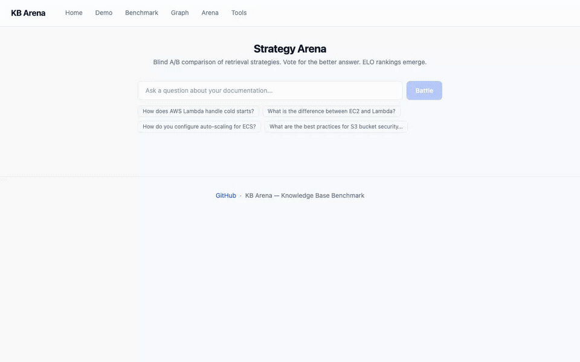
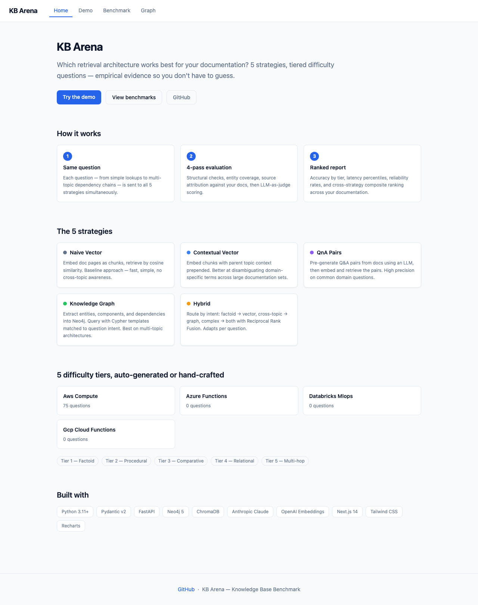
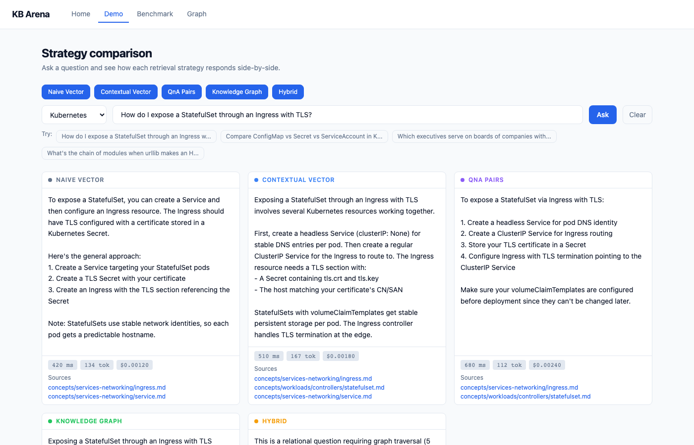
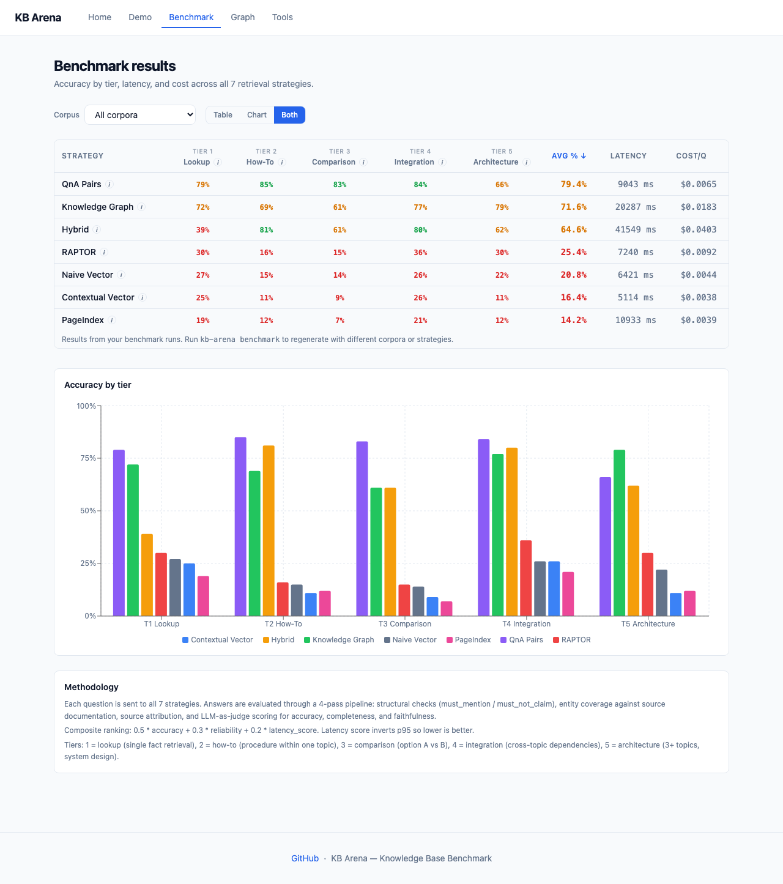
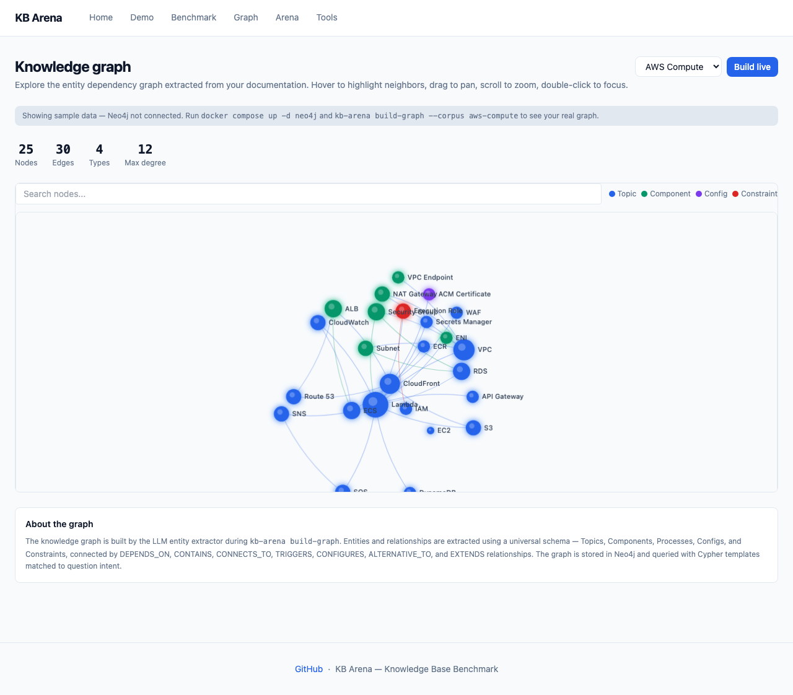
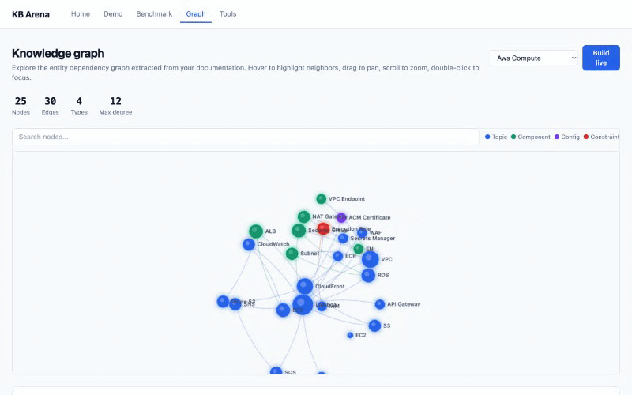
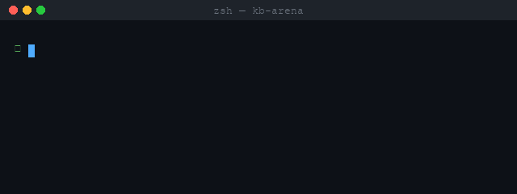
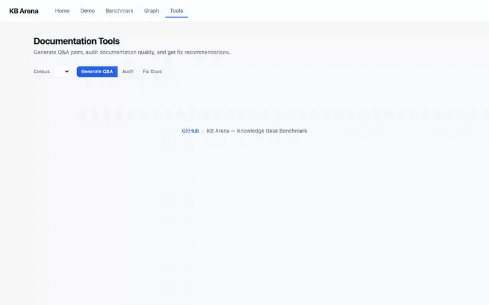
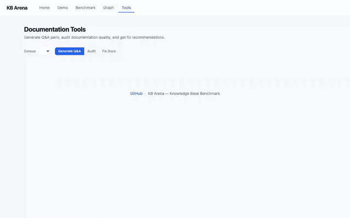

# KB Arena

Which retrieval architecture works best for your documentation?

KB Arena benchmarks **8 retrieval strategies** -- naive vector, contextual vector, Q&A pairs, knowledge graph, hybrid, RAPTOR, PageIndex, and BM25 -- on **your** documentation. Bring your docs in any format, run the pipeline, get empirical results. Ships with an AWS Compute corpus (75 questions across 5 difficulty tiers) as a built-in example.

     


---

## Try It in 10 Seconds

No API keys. No Docker. Just explore real benchmark results:

```bash
pip install kb-arena
kb-arena demo
```

This launches the dashboard with pre-computed results from the AWS Compute corpus (75 questions, 8 strategies, 5 difficulty tiers).

---

## How KB Arena Differs from Other RAG Evaluation Tools

Most RAG evaluation tools answer "how well does my pipeline work?" KB Arena answers a different question: "which retrieval architecture works best for my docs?"

| | KB Arena | RAGAS | MTEB / BEIR | GraphRAG | DeepEval |
|---|---|---|---|---|---|
| Compares multiple architectures | Yes - 8 strategies | No - evaluates your existing pipeline | No - compares embedding models | No - only their own approach | No |
| Works on your own docs | Yes | Yes | No - fixed public datasets | No - fixed datasets | Yes |
| Includes graph + vector + hybrid | Yes | Vector/hybrid only | Embeddings only | Graph only | Any |
| Auto-generates benchmark questions | Yes - 5 difficulty tiers | Manual | Fixed | Fixed | Manual |
| Interactive comparison UI | Yes - chatbot + benchmark explorer | No | Leaderboard only | No | Dashboard |
| Chatbot per strategy | Yes | No | No | No | No |
| Standard IR metrics (NDCG, MRR) | Roadmap | Yes | Yes | Partial | No |

If you want to know whether a knowledge graph, Q&A pairs, or plain vector search is the right architecture for your documentation, that's what KB Arena is for.

---

## What's New in v0.3.0

### Multi-LLM Provider Support

No longer locked to Anthropic. Choose your LLM backend:

```bash
# Anthropic (default)
export KB_ARENA_LLM_PROVIDER=anthropic
export KB_ARENA_ANTHROPIC_API_KEY=sk-ant-...

# OpenAI
export KB_ARENA_LLM_PROVIDER=openai
export KB_ARENA_OPENAI_API_KEY=sk-...

# Ollama (free local inference)
export KB_ARENA_LLM_PROVIDER=ollama
```

Each provider has its own model mapping -- GPT-4o for generation, GPT-4o-mini for classification when using OpenAI; any local model when using Ollama.

### Strategy Arena - Blind A/B Comparison

A new **Arena mode** for blind head-to-head strategy battles. Ask a question, two random strategies answer it, you vote for the better response. ELO ratings emerge over time.

```bash
kb-arena serve  # then open /arena in your browser
```



### BM25 Baseline Strategy

Strategy #8: classic BM25 keyword matching. The pre-neural baseline that answers "do I even need embeddings for my docs?" Uses BM25Okapi scoring with LLM answer generation.

### Parallel Benchmark Execution

Strategies now run concurrently instead of sequentially. A full 8-strategy benchmark that took 60-90 minutes now completes in 15-25 minutes.

```bash
kb-arena benchmark --corpus my-docs              # parallel by default
kb-arena benchmark --corpus my-docs --no-parallel # sequential if needed
```

### Accurate Token Counting

Replaced whitespace tokenization with tiktoken (cl100k_base BPE). Chunk sizes are now measured in real tokens, not word counts. Previous "512-token chunks" were actually ~370 real tokens - now they're exactly 512.

### Cost Tracking Fixed

Fixed cost propagation across all multi-call strategies:
- Knowledge graph: Text-to-Cypher generation cost now tracked
- PageIndex: beam traversal LLM cost now accumulated
- Streaming: token usage captured via `get_final_message()`
- Latency decomposition: retrieval vs generation timing now measured separately

### Run Comparison

Benchmark runs now have unique IDs and timestamps. Results are preserved across runs instead of overwritten:

```bash
kb-arena benchmark --corpus my-docs
# Run ID: a1b2c3d4
# Results: results/run_a1b2c3d4/my-docs_naive_vector.json

kb-arena report --run-id a1b2c3d4
```

### CI/CD Integration

Fail your pipeline if retrieval quality drops:

```bash
kb-arena benchmark --corpus my-docs --fail-below 0.7
# Exit code 1 if any strategy's accuracy falls below 70%
```

### Export Formats

Generate reports in CSV or self-contained HTML:

```bash
kb-arena report --format csv    # spreadsheet-ready
kb-arena report --format html   # shareable dashboard
```

### Bundled Frontend

`kb-arena demo` now serves a complete dashboard -- no separate Next.js dev server needed. The static frontend is bundled with the pip package.

## What's New in v0.3.1

### Production Hardening

Session management, error handling, and API configuration improvements for real deployments:

- **Session ID support** -- pass `X-Session-ID` header instead of relying on IP-based sessions. Fixes shared proxy and network-switching issues.
- **Session TTL** -- idle sessions are automatically evicted (default 30 min, configurable via `KB_ARENA_SESSION_TTL_MINUTES`)
- **CORS configuration** -- set allowed origins via `KB_ARENA_CORS_ORIGINS` env var instead of hardcoded localhost
- **Corpus validation** -- graph build API validates corpus exists with processed documents before starting
- **Specific exception handling** -- Neo4j connection errors, graph extraction failures, and stream errors now catch specific types instead of bare `except Exception`

### Streaming Cost Tracking

OpenAI and Ollama providers now capture token usage after streaming completes -- previously only Anthropic tracked streaming costs. The chatbot demo now reports accurate `cost_usd` for all three providers.

### Faster QnA Index Building

Q&A pair generation during `build-vectors` is now parallelized with `asyncio.gather()` (5 concurrent). Building QnA indexes on large corpora is up to 5x faster.

### Custom Exception Hierarchy

New `kb_arena.exceptions` module with typed exceptions (`IngestError`, `GraphError`, `StrategyError`, `EvaluationError`, `LLMError`) for better error handling and debugging.

### Frontend Error Boundary

React error boundary wraps all page content -- API failures and render errors now show a recovery UI instead of a blank page.

### Graph Schema Cleanup

Removed dead Cypher templates that referenced non-existent relationship types (`DEPRECATED_BY`, `INHERITS`, `REQUIRES`, `EXAMPLE_OF`). Remaining templates now use only valid universal schema types.

### Changelog

| Version | Date | Changes |
|---------|------|---------|
| 0.3.1 | 2026-03-26 | Production hardening (session IDs, TTL, CORS config, corpus validation), streaming cost for OpenAI/Ollama, parallel QnA build, custom exceptions, error boundary, graph schema cleanup, 494 tests |
| 0.3.0 | 2026-03-20 | Multi-LLM providers (Anthropic/OpenAI/Ollama), Strategy Arena, BM25 strategy, parallel benchmarks, tiktoken chunking, cost tracking fixes, run comparison, CI fail-below, CSV/HTML export, bundled frontend |
| 0.2.1 | 2026-03-03 | PageIndex strategy, verbose mode, retry logic, parallel extraction, eval independence |
| 0.2.0 | 2026-02-28 | RAPTOR strategy, hybrid improvements, 7 strategies total |
| 0.1.0 | 2026-02-20 | Initial release: 5 strategies, benchmark engine, chatbot demo |

---

## Quick Start -- I Just Have My Docs

You have documentation files (markdown, HTML, text, PDFs). You want to know which retrieval strategy works best. Here's everything from zero.

### Prerequisites

1. **Python 3.11+** and **pip**
2. **Docker** (for Neo4j — the knowledge graph strategy needs it)
3. **API keys** for your LLM provider (Anthropic, OpenAI, or Ollama) and OpenAI (embeddings)

That's it. No Neo4j expertise needed. No graph database experience required. KB Arena handles the schema, extraction, and querying.

### Step 1: Install

```bash
pip install kb-arena

# Optional: install format-specific parsers
pip install kb-arena[pdf]        # PDF support (PyMuPDF)
pip install kb-arena[docx]       # Word documents (mammoth)
pip install kb-arena[web]        # Web scraping (httpx)
pip install kb-arena[all-formats] # All of the above
```

### Step 2: Set API keys

Create a `.env` file or export directly:

```bash
export KB_ARENA_ANTHROPIC_API_KEY=sk-ant-...    # Claude for generation + evaluation
export KB_ARENA_OPENAI_API_KEY=sk-...           # OpenAI for text-embedding-3-large
```

### Step 3: Start Neo4j

KB Arena uses Neo4j for the knowledge graph strategy. One command:

```bash
docker compose up neo4j -d
```

This starts Neo4j on `localhost:7687` with default credentials (`neo4j` / `kbarena1`). No configuration needed — KB Arena creates the schema automatically.

If you don't have the `docker-compose.yml`, create one:

```yaml
services:
  neo4j:
    image: neo4j:5-community
    ports:
      - "7474:7474"
      - "7687:7687"
    environment:
      - NEO4J_AUTH=neo4j/kbarena1
      - NEO4J_PLUGINS=["apoc"]
    volumes:
      - neo4j_data:/data

volumes:
  neo4j_data:
```

**Don't want Docker?** KB Arena still works — the vector strategies, RAPTOR, and PageIndex run without Neo4j. Only the knowledge graph and hybrid strategies need it.

### Step 4: Run the pipeline

```bash
# Scaffold a new corpus
kb-arena init-corpus my-docs

# Drop your docs into the raw/ directory
cp ~/my-documentation/*.md datasets/my-docs/raw/
# Supports: .md, .html, .txt, .pdf, .docx, .csv, .tsv — auto-detected

# Parse into the unified Document model (JSONL intermediate files)
kb-arena ingest datasets/my-docs/raw/ --corpus my-docs

# Or ingest directly from a URL or GitHub repo
kb-arena ingest https://docs.example.com --corpus my-docs
kb-arena ingest github:owner/repo --corpus my-docs

# Build the knowledge graph in Neo4j (entities + relationships)
kb-arena build-graph --corpus my-docs

# Build vector indexes in ChromaDB (local, no server needed)
kb-arena build-vectors --corpus my-docs

# Auto-generate benchmark questions from your docs (10 per difficulty tier)
kb-arena generate-questions --corpus my-docs --count 50

# Run the benchmark (each question x 7 strategies, 4-pass evaluation)
kb-arena benchmark --corpus my-docs

# Launch the web UI to explore results
kb-arena serve
```

Open `http://localhost:8000` for the API, `http://localhost:3000` for the dashboard.

### Step 5: Read the results

The benchmark produces:
- **Accuracy by tier** — which strategy handles simple lookups vs multi-hop architecture questions
- **Latency percentiles** — p50, p95, p99 per strategy
- **Cost per query** — token usage and API cost
- **Composite ranking** — 0.5 * accuracy + 0.3 * reliability + 0.2 * latency

Results are saved to `results/` as JSON and displayed in the web dashboard.

---

## Full Stack with Docker Compose

Run everything — Neo4j, the API server, and the frontend — in one command:

```bash
# Set your API keys
export ANTHROPIC_API_KEY=sk-ant-...
export OPENAI_API_KEY=sk-...

# Start all services
docker compose up -d

# Open the dashboard
open http://localhost:3000
```

The compose file starts Neo4j (port 7474/7687), the FastAPI backend (port 8000), and the Next.js frontend (port 3000).

---

## Using the Built-in AWS Example

The AWS Compute corpus ships ready to use (75 questions across 5 difficulty tiers):

```bash
kb-arena ingest ./datasets/aws-compute/raw/ --corpus aws-compute
kb-arena build-graph --corpus aws-compute
kb-arena build-vectors --corpus aws-compute
kb-arena benchmark --corpus aws-compute
kb-arena serve
```

---

## Screenshots

**Home** — Overview of the 7 strategies, difficulty tiers, and evaluation methodology.



**Strategy comparison** — Ask the same question to all 7 strategies simultaneously. Compare answers, sources, latency, and cost side-by-side.



**Benchmark results** — Accuracy table by tier with grouped bar chart.



**Knowledge graph** — Interactive force-directed visualization of entities extracted from your docs.



**Live graph build** — Watch entities and relationships stream in as the extractor runs.



---

## Documentation Tools

Beyond benchmarking, KB Arena includes three standalone tools that work on any documentation corpus.

All three tools are available as CLI commands and through the web UI at `/tools`.

### Q&A Generator

Generate Q&A pairs from your docs — use them for chatbot training, FAQ pages, or search indexes. Only needs an Anthropic key (no embeddings, no vector DB).

```bash
kb-arena generate-qa --corpus my-docs
# Outputs: datasets/my-docs/qa-pairs/qa_pairs.jsonl
```

**CLI**



**Web UI**


### Docs Gap Analyzer

Find what's missing in your documentation before your users complain about it. Generates Q&A pairs per section, self-evaluates them, and classifies each section as strong (>=70%), weak (30-70%), or gap (<30%).

```bash
kb-arena audit --corpus my-docs
```

**CLI**


**Web UI**



### Fix My Docs

Get actionable recommendations with draft content to improve your docs. Runs the audit internally, then generates prioritized fixes for weak and gap sections.

```bash
kb-arena fix --corpus my-docs --max-fixes 5
```

**CLI**


**Web UI**



Pipeline: `generate-qa` → `audit` → `fix` — each command builds on the previous. Or run them independently via CLI or the web UI.

---

## Benchmark Results (AWS Compute Corpus)

Real numbers from 75 questions across 5 difficulty tiers, evaluated with a 4-pass system (structural checks + LLM-as-judge):

| Strategy | Overall | T1 Lookup | T2 How-To | T3 Comparison | T4 Integration | T5 Architecture | Avg Latency | Cost |
|---|---|---|---|---|---|---|---|---|
| **Q&A Pairs** | **79.2%** | 79% | 85% | **83%** | **84%** | 66% | 9.0s | $0.48 |
| Knowledge Graph | 71.5% | 72% | 69% | 61% | 77% | **79%** | 20.3s | $1.37 |
| Hybrid | 64.7% | 39% | 81% | 61% | 80% | 62% | 41.5s | $3.02 |
| RAPTOR | 25.3% | 30% | 16% | 15% | 36% | 30% | 7.2s | $0.69 |
| Naive Vector | 20.7% | 27% | 15% | 14% | 26% | 22% | 6.4s | $0.33 |
| Contextual Vector | 16.5% | 25% | 11% | 9% | 26% | 11% | 5.1s | $0.29 |
| PageIndex | 14.3% | 19% | 12% | 7% | 21% | 12% | 10.9s | $0.29 |

**Key takeaway:** Q&A pairs dominate overall because pre-generated answers sidestep retrieval failures. Knowledge graph leads on architecture questions (T5: 79%) where structured graph traversal shines. The hybrid strategy adapts per question type but pays a latency/cost premium. PageIndex — the vectorless, reasoning-based approach — scores comparably to contextual vector at $0.29, demonstrating that LLM tree traversal is a viable alternative to embeddings on well-structured docs. RAPTOR's hierarchical retrieval shows strength at T4/T5 but needs a larger corpus. Pure vector RAG — what most teams ship — scores under 21%. Cost ranges from $0.29 (contextual vector / pageindex) to $3.02 (hybrid) for the full 75-question benchmark.

These are results from the built-in AWS Compute corpus. Your mileage will vary — that's the whole point of running it on your own docs.

---

## The 7 Strategies

| # | Strategy | How it works | Best at |
|---|----------|-------------|---------|
| 1 | **Naive Vector** | Chunk → embed → cosine similarity → generate | Fast lookups, simple factoid questions |
| 2 | **Contextual Vector** | Chunk + parent context → embed → rank | Disambiguating domain-specific terms |
| 3 | **Q&A Pairs** | LLM pre-generates Q&A at index time → match | Common questions with known answers |
| 4 | **Knowledge Graph** | Entities → Neo4j → Cypher templates → generate | Multi-hop dependencies, cross-topic queries |
| 5 | **Hybrid** | Intent routing → vector or graph or both (RRF) | Adapts per question type |
| 6 | **RAPTOR** | Cluster chunks → LLM topic summaries → recursive tree → query all levels | Cross-document synthesis, broad topic questions |
| 7 | **PageIndex** | Build tree index from doc structure → LLM beam search traversal → no vectors | Well-structured docs, reasoning over hierarchy |

---

## Question Tiers

Questions are organized into 5 difficulty tiers:

| Tier | Type | Hops | What it tests |
|------|------|------|---------------|
| 1 | Lookup | 1 | Single-fact lookup from one document |
| 2 | How-To | 1-2 | Multi-step processes, configuration sequences |
| 3 | Comparison | 2-3 | Comparing alternatives, trade-offs between options |
| 4 | Integration | 3-4 | Dependencies and connections between concepts |
| 5 | Architecture | 3-5 | Cross-document synthesis, transitive reasoning |

Use `kb-arena generate-questions` to auto-generate questions from your docs, or write them by hand in YAML.

---

## Supported Formats

| Format | Extensions / Input | Optional Dep | Notes |
|--------|-------------------|--------------|-------|
| Markdown | `.md`, `.markdown`, `.rst` | — | Heading hierarchy, code blocks, tables |
| HTML | `.html`, `.htm` | — | Strips nav/footer, extracts structure |
| Plain text | `.txt`, `.text` | — | ALL CAPS heading detection |
| PDF | `.pdf` | `kb-arena[pdf]` | Font-size heading detection, table extraction |
| Word | `.docx` | `kb-arena[docx]` | Converts to HTML, then extracts structure |
| CSV / TSV | `.csv`, `.tsv` | — | Auto-detects delimiter, groups rows into sections |
| Web URL | `https://...` | `kb-arena[web]` | Crawls same-domain pages; uses `/llms.txt` if available |
| GitHub | `github:owner/repo` | — | Shallow clones and ingests all doc files |
| SEC EDGAR | `--format sec-edgar` | — | 10-K/10-Q filing parser |

---

## Universal Documentation Schema

KB Arena extracts entities and relationships using a universal schema that works for any documentation domain:

**5 node types:** Topic, Component, Process, Config, Constraint
**7 relationship types:** DEPENDS_ON, CONTAINS, CONNECTS_TO, TRIGGERS, CONFIGURES, ALTERNATIVE_TO, EXTENDS

No per-domain configuration needed. The LLM maps your documentation concepts to these types automatically.

---

## CLI Reference

| Command | Description |
|---|---|
| `demo` | Launch dashboard with pre-computed results (no API keys needed) |
| `init-corpus <name>` | Scaffold `datasets/{name}/` directories |
| `ingest <path>` | Parse docs into JSONL. Accepts files, dirs, URLs, `github:owner/repo`. Options: `--corpus`, `--format`, `--dry-run` |
| `build-graph` | Extract entities/rels into Neo4j. Options: `--corpus` |
| `build-vectors` | Build vector indexes + PageIndex tree. Options: `--corpus`, `--strategy` |
| `generate-questions` | Auto-generate benchmark questions. Options: `--corpus`, `--count` |
| `benchmark` | Run evaluation. Options: `--corpus`, `--strategy`, `--tier`, `--dry-run` |
| `generate-qa` | Generate Q&A pairs from your docs as JSONL. Options: `--corpus`, `--output` |
| `audit` | Find documentation gaps — classifies sections as strong/weak/gap. Options: `--corpus`, `--output`, `--max-sections` |
| `fix` | Generate fix recommendations with draft content. Options: `--corpus`, `--max-fixes`, `--output` |
| `report` | Generate report. Options: `--corpus`, `--output`, `--format` (rich/json) |
| `serve` | Launch API + frontend. Options: `--host`, `--port` |
| `health` | Pipeline status. Options: `--format` (rich/json) |

All commands are independently re-runnable. Each stage writes to disk so you can re-run any step without repeating earlier ones.

### CLI Features

**Dry run** — Preview what a command will do before committing to expensive LLM calls:

```bash
kb-arena ingest datasets/my-docs/raw/ --corpus my-docs --dry-run
# Shows: file count by extension, parser assignment, output path

kb-arena benchmark --corpus my-docs --dry-run
# Shows: question count, strategy list, total queries, concurrency settings
```


**JSON output** — Pipe structured data to `jq`, scripts, or CI pipelines:

```bash
kb-arena report --corpus my-docs --format json | jq '.corpora'
kb-arena health --format json | jq '.services'
```


**Pipeline hints** — After every command, see what to run next:

```
$ kb-arena ingest datasets/my-docs/raw/ --corpus my-docs
Done. 12 documents, 47 sections → datasets/my-docs/processed/documents.jsonl

Next: kb-arena build-graph --corpus my-docs && kb-arena build-vectors --corpus my-docs
```

**Progress bars** — Every long-running command shows real-time progress (extraction sections, Neo4j batch loading, vector index building, question generation tiers).

**Cost tracking** — Benchmark runs display cumulative API cost in the progress bar and print per-strategy cost/accuracy summaries after completion.

**Verbose mode** — Add `--verbose` / `-v` to any command for debug logging:

```bash
kb-arena benchmark --corpus my-docs --verbose
```

---

## Reliability and Performance

**LLM retry with backoff** — All Anthropic API calls retry up to 3 times with exponential backoff (1s, 2s, 4s) on rate limits, timeouts, and server errors. Every call has a 60-second hard timeout.

**Parallel graph extraction** — Entity/relationship extraction from document sections runs up to 5 sections concurrently (5-10x faster than sequential for large corpora).

**Parallel hybrid reranking** — The hybrid strategy's passage re-ranking runs all scoring calls concurrently using Haiku instead of sequential Sonnet calls (~50s to ~5s on procedural queries).

**Evaluation independence** — The LLM-as-judge evaluator uses a different model (`JUDGE_MODEL`, defaults to Opus) than the generation model (Sonnet) to avoid same-model scoring bias.

**Cypher safety** — LLM-generated Cypher queries are checked for write operations (`CREATE`, `MERGE`, `DELETE`, etc.) and blocked before execution. Only read queries reach Neo4j.

---

## Environment Variables

All prefixed with `KB_ARENA_`. Loaded from `.env` or environment.

| Variable | Default | Required | Description |
|----------|---------|----------|-------------|
| `ANTHROPIC_API_KEY` | — | Yes | Claude for generation, evaluation, extraction |
| `OPENAI_API_KEY` | — | Yes | OpenAI for text-embedding-3-large |
| `NEO4J_URI` | `bolt://localhost:7687` | No | Neo4j connection |
| `NEO4J_USER` | `neo4j` | No | Neo4j username |
| `NEO4J_PASSWORD` | — | No | Neo4j password (set to match `NEO4J_AUTH` in docker-compose) |
| `JUDGE_MODEL` | `claude-opus-4-6` | No | Model used for LLM-as-judge evaluation (default differs from generate model to avoid self-evaluation bias) |
| `CHROMA_PATH` | `./chroma_data` | No | ChromaDB storage path |
| `EMBEDDING_MODEL` | `text-embedding-3-large` | No | OpenAI embedding model |
| `EMBEDDING_DIMENSIONS` | `3072` | No | Embedding vector dimensions |
| `GENERATE_MODEL` | `claude-sonnet-4-6` | No | Generation model |
| `FAST_MODEL` | `claude-haiku-4-5-20251001` | No | Classification model |
| `HOST` | `0.0.0.0` | No | Server bind address |
| `PORT` | `8000` | No | Server port |
| `DEBUG` | `false` | No | Debug mode |
| `BENCHMARK_TEMPERATURE` | `0.0` | No | LLM temperature for benchmarks |
| `BENCHMARK_MAX_CONCURRENT` | `5` | No | Parallel benchmark queries |
| `BENCHMARK_QUERY_TIMEOUT_S` | `120` | No | Per-query timeout (seconds) |
| `BENCHMARK_MAX_RETRIES` | `2` | No | Retry count on failures |
| `PAGEINDEX_BEAM_WIDTH` | `3` | No | Branches to explore per tree level |
| `PAGEINDEX_MAX_DEPTH` | `4` | No | Maximum tree traversal depth |
| `DATASETS_PATH` | `./datasets` | No | Datasets directory |
| `RESULTS_PATH` | `./results` | No | Results output directory |

---

## Development

```bash
# Install with dev dependencies
pip install -e '.[dev]'

# Run tests
pytest tests/ -v --ignore=tests/live  # 454 tests

# Lint + format
ruff check . && ruff format --check .

# Frontend
cd web && npm install && npx next build
```

---

## Tech Stack

| Component | Technology |
|-----------|-----------|
| LLM | Claude Sonnet 4.6 (generation) + Haiku 4.5 (classification) |
| Embeddings | text-embedding-3-large (3072-dim) |
| Vector store | ChromaDB 0.5 (local, no server) |
| Graph store | Neo4j 5 Community |
| Backend | FastAPI + SSE streaming |
| Frontend | Next.js 14 + Tailwind + Recharts |
| Models | Pydantic v2 |
| CLI | Typer + Rich |
| Testing | pytest (454 tests) |

---

## License

MIT
